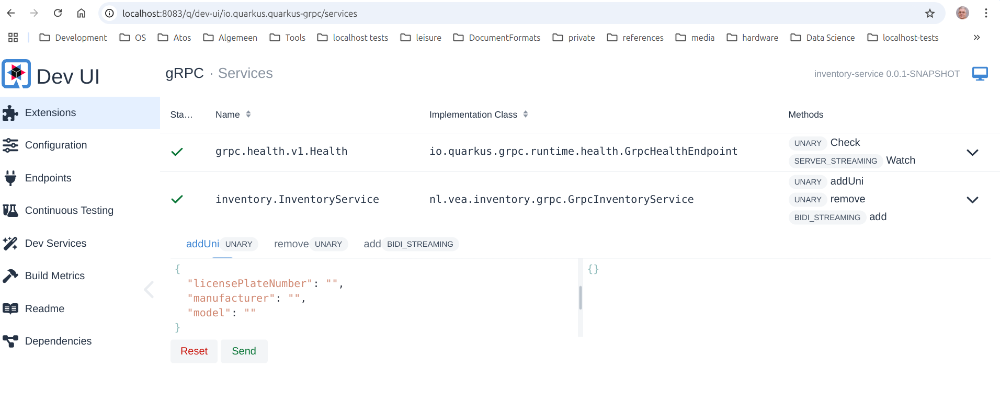

<style>
body {
  font-family: Spectral, "Gentium Basic", Cardo, "Linux Libertine o", "Palatino Linotype", Cambria, serif;
  font-size: 100% !important;
  padding-right: 12%;
  //margin-right: 12%;
}
code {
	padding: 0.25em;
	
	white-space: pre;
	font-family: "Tlwg mono", Consolas, "Liberation Mono", Menlo, Courier, monospace;
	
	background-color: #ECFFFA;
	//border: 1px solid #ccc;
	//border-radius: 3px;
}

kbd {
	display: inline-block;
	padding: 3px 5px;
	font-family: "Tlwg mono", Consolas, "Liberation Mono", Menlo, Courier, monospace;
	line-height: 10px;
	color: #555;
	vertical-align: middle;
	background-color: #ECFFFA;
	border: solid 1px #ccc;
	border-bottom-color: #bbb;
	border-radius: 3px;
	box-shadow: inset 0 -1px 0 #bbb;
}

h1,h2,h3,h4,h5 {
  color: #269B7D; 
  font-family: "fira sans", "Latin Modern Sans", Calibri, "Trebuchet MS", sans-serif;
}

img {
  width: auto; 
  height: 80%;
  max-height: 100%; 
}
</style>

# 4 Handling communications

## Change of setup
- It occurred to me that we will have several (micro)services under the `~/git/quia` root dir. We, therefore, moved our
  efforts from chapter 2 & 3 into `~/git/quia/services/first-service/`, where we changed the `artifact-id` to
  `first-service` as well, therefore
  - `nl.vea.quia:first-service` is the full maven project (module) name (without version). 
- All new services will be established under the `~/git/quia/services/` directory and the git repo remains under 
  `~/git/quia`.
- For IntelliJ projects to be easily navigable and keep everything under a single __quia__ parent project umbrella, we
  also introduced a parent pom for a `nl.vea.quia:quia` project with `pom` type packaging residing under the
  `~/git/quia` root.
- To keep all the services as independent as possible we decided to only move the properties containing the versions
  of the various dependencies to the parent pom and keep all the other structure under the service module pom files.
- However, we have parent references to `nl.vea.quia:quia` in our module poms and module references in our parent pom.
  - Hence, we can build all maven (service) modules from building the parent and 
  - the module poms can defer the values of the properties to those defined in the parent pom.
- we can still run the old quia service module (now named first-service) in dev mode: 
  `~/git/quia/services/first-service$ quarkus dev`
- we can still build the old quia service module (now named first-service) in isolation:
  `~/git/quia/services/first-service$ mvn clean package -e`
- we should be able to run a jvm version of production with 
  `~/git/quia/services/first-service$ java -jar target/quarkus-app/quarkus-run.jar`, but we experimented with oidc in 
  dev mode, therefore we get '`quarkus.oidc.auth-server-url' property must be configured`. 
  - For now this isn't very important to solve.

### Adding a service in the new setup
- In general, we can follow the `quarkus create app` CLI calls used in the book, whereby we 
  - always start at the `~/git/quia/services/` directory,
  - use `nl.vea.quia:{name}-service` as the maven `groupId:artifactId` added
  - never specify a version by adding something like `-P 3.15.1` so we get the latest stable version of 
    `io.quarkus.platform:quarkus-bom`. 
    - We then will try out in the parent pom if we can update all services to a newer version.
    - 

## §4.2 Car rental Service
- If we look at [quarkus-installable-extensions-list.txt](quarkus-installable-extensions-list.txt) we notice that we 
  have to specify different extension names then mentioned in the book MEAP V09:
  - `quarkus-rest-jackson` instead of `quarkus-resteasy-reactive-jackson`
  - `quarkus-rest-client-jackson` instead of `rest-client-reactive-jackson`
  - `quarkus-smallrye-openapi` seems to be ok.
- This is also confirmed by looking at [https://github.com/xstefank/quarkus-in-action/blob/main/chapter-04/4_2/reservation-service/pom.xml](https://github.com/xstefank/quarkus-in-action/blob/main/chapter-04/4_2/reservation-service/pom.xml)
  - This also still has the same versions set in properties that we moved to the quia pom for uniformity.
- We therefore arrive at the following CLI command:
  ```bash
   ~/git/quia/services$ quarkus create app \
   --extension quarkus-rest-jackson,quarkus-rest-client-jackson,quarkus-smallrye-openapi --no-code`
  ```

  <details>

  ```bash
  willem@linux-laptop:~/git/quia/services$ quarkus create app \
  --extension quarkus-rest-jackson,quarkus-rest-client-jackson,quarkus-smallrye-openapi --no-code
  Looking for the newly published extensions in registry.quarkus.io
  -----------
  selected extensions:
  - io.quarkus:quarkus-smallrye-openapi
    - io.quarkus:quarkus-rest-jackson
    - io.quarkus:quarkus-rest-client-jackson
  
  
  applying codestarts...
  📚 java
  🔨 maven
  📦 quarkus
  📝 config-properties
  🔧 tooling-dockerfiles
  🔧 tooling-maven-wrapper
  
  -----------
  [SUCCESS] ✅  quarkus project has been successfully generated in:
  --> /home/willem/git/quia/services/code-with-quarkus
  -----------
  Navigate into this directory and get started: quarkus dev
  willem@linux-laptop:~/git/quia/services$ quarkus create app nl.vea.quia:reservation-service --extension quarkus-rest-jackson,quarkus-rest-client-jackson,quarkus-smallrye-openapi --no-code
  -----------
  selected extensions:
  - io.quarkus:quarkus-smallrye-openapi
    - io.quarkus:quarkus-rest-jackson
    - io.quarkus:quarkus-rest-client-jackson
  
  
  applying codestarts...
  📚 java
  🔨 maven
  📦 quarkus
  📝 config-properties
  🔧 tooling-dockerfiles
  🔧 tooling-maven-wrapper
  
  -----------
  [SUCCESS] ✅  quarkus project has been successfully generated in:
  --> /home/willem/git/quia/services/reservation-service
  -----------
  Navigate into this directory and get started: quarkus dev
  willem@linux-laptop:~/git/quia/services$
  ```

  </details>
  
### Modifications of the primary generated files
- The resulting pom still has the same version values as those from the parent pom except for `surefire-plugin.version`,
  which has been updated in the parent pom to `3.5.0` whilst the generated code still uses `3.3.1`.
- Now we start to integrate the service with its parent by modifying both pom files and 
- remove the `~/git/quia/services/reservation-service/.gitignore` as this is already present for the entire repository
  at`~/git/quia/.gitignore`
- we still have to figure out what to do with the various `.dockerignore`, but I suspect these should be present in the 
  service root.
- Furthermore, we created a `.sdkmanrc` file to facilitate changing to a Java 21 version.
  - `~/git/quia/services/reservation-service$ sdk use java 21.0.4-tem` and then
  - `~/git/quia/services/reservation-service$ sdk env init`
- Then we did a first `~/git/quia/services/reservation-service$ mvn clean package -e` to check if the maven 
  configuration works. There still isn't any source code, but dependencies are found and downloaded.
- Also running a `mvn clean package -e` inside the maven tool window (on `quia` level) works fine.

#### CLI details of the steps mentioned above

<details>

```bash
willem@linux-laptop:~/git/quia$ cd services/reservation-service/
willem@linux-laptop:~/git/quia/services/reservation-service$ sdk current

Using:

java: 17.0.12-tem
maven: 3.9.9
quarkus: 3.15.1
spark: 3.5.1
willem@linux-laptop:~/git/quia/services/reservation-service$ sdk use java 21.0.4-tem

Using java version 21.0.4-tem in this shell.
willem@linux-laptop:~/git/quia/services/reservation-service$ sdk env init
.sdkmanrc created.
willem@linux-laptop:~/git/quia/services/reservation-service$ mvn clean package -e
[INFO] Error stacktraces are turned on.
[INFO] Scanning for projects...
[INFO] 
[INFO] ------------------< nl.vea.quia:reservation-service >-------------------
[INFO] Building reservation-service 1.0.0-SNAPSHOT
[INFO]   from pom.xml
[INFO] --------------------------------[ jar ]---------------------------------
Downloading from central: https://repo.maven.apache.org/maven2/io/quarkus/quarkus-smallrye-openapi/3.15.1/quarkus-smallrye-openapi-3.15.1.pom
Downloaded from central: https://repo.maven.apache.org/maven2/io/quarkus/quarkus-smallrye-openapi/3.15.1/quarkus-smallrye-openapi-3.15.1.pom (2.8 kB at 15 kB/s)
Downloading from central: https://repo.maven.apache.org/maven2/io/quarkus/quarkus-smallrye-openapi-parent/3.15.1/quarkus-smallrye-openapi-parent-3.15.1.pom
Downloaded from central: https://repo.maven.apache.org/maven2/io/quarkus/quarkus-smallrye-openapi-parent/3.15.1/quarkus-smallrye-openapi-parent-3.15.1.pom (739 B at 74 kB/s)
Downloading from central: https://repo.maven.apache.org/maven2/io/quarkus/quarkus-swagger-ui/3.15.1/quarkus-swagger-ui-3.15.1.pom
Downloaded from central: https://repo.maven.apache.org/maven2/io/quarkus/quarkus-swagger-ui/3.15.1/quarkus-swagger-ui-3.15.1.pom (2.2 kB at 222 kB/s)
Downloading from central: https://repo.maven.apache.org/maven2/io/quarkus/quarkus-swagger-ui-parent/3.15.1/quarkus-swagger-ui-parent-3.15.1.pom
Downloaded from central: https://repo.maven.apache.org/maven2/io/quarkus/quarkus-swagger-ui-parent/3.15.1/quarkus-swagger-ui-parent-3.15.1.pom (744 B at 68 kB/s)
Downloading from central: https://repo.maven.apache.org/maven2/io/quarkus/quarkus-rest-jackson/3.15.1/quarkus-rest-jackson-3.15.1.pom
Downloaded from central: https://repo.maven.apache.org/maven2/io/quarkus/quarkus-rest-jackson/3.15.1/quarkus-rest-jackson-3.15.1.pom (2.4 kB at 45 kB/s)
Downloading from central: https://repo.maven.apache.org/maven2/io/quarkus/quarkus-rest-jackson-parent/3.15.1/quarkus-rest-jackson-parent-3.15.1.pom
Downloaded from central: https://repo.maven.apache.org/maven2/io/quarkus/quarkus-rest-jackson-parent/3.15.1/quarkus-rest-jackson-parent-3.15.1.pom (752 B at 75 kB/s)
Downloading from central: https://repo.maven.apache.org/maven2/io/quarkus/quarkus-rest-jackson-common/3.15.1/quarkus-rest-jackson-common-3.15.1.pom
Downloaded from central: https://repo.maven.apache.org/maven2/io/quarkus/quarkus-rest-jackson-common/3.15.1/quarkus-rest-jackson-common-3.15.1.pom (2.3 kB at 258 kB/s)
Downloading from central: https://repo.maven.apache.org/maven2/io/quarkus/quarkus-rest-jackson-common-parent/3.15.1/quarkus-rest-jackson-common-parent-3.15.1.pom
Downloaded from central: https://repo.maven.apache.org/maven2/io/quarkus/quarkus-rest-jackson-common-parent/3.15.1/quarkus-rest-jackson-common-parent-3.15.1.pom (771 B at 86 kB/s)
Downloading from central: https://repo.maven.apache.org/maven2/io/quarkus/resteasy/reactive/resteasy-reactive-jackson/3.15.1/resteasy-reactive-jackson-3.15.1.pom
Downloaded from central: https://repo.maven.apache.org/maven2/io/quarkus/resteasy/reactive/resteasy-reactive-jackson/3.15.1/resteasy-reactive-jackson-3.15.1.pom (2.6 kB at 294 kB/s)
Downloading from central: https://repo.maven.apache.org/maven2/io/quarkus/quarkus-jackson/3.15.1/quarkus-jackson-3.15.1.pom
Downloaded from central: https://repo.maven.apache.org/maven2/io/quarkus/quarkus-jackson/3.15.1/quarkus-jackson-3.15.1.pom (3.0 kB at 330 kB/s)
Downloading from central: https://repo.maven.apache.org/maven2/io/quarkus/quarkus-rest-client-jackson/3.15.1/quarkus-rest-client-jackson-3.15.1.pom
Downloaded from central: https://repo.maven.apache.org/maven2/io/quarkus/quarkus-rest-client-jackson/3.15.1/quarkus-rest-client-jackson-3.15.1.pom (2.4 kB at 239 kB/s)
Downloading from central: https://repo.maven.apache.org/maven2/io/quarkus/quarkus-rest-client-jackson-parent/3.15.1/quarkus-rest-client-jackson-parent-3.15.1.pom
Downloaded from central: https://repo.maven.apache.org/maven2/io/quarkus/quarkus-rest-client-jackson-parent/3.15.1/quarkus-rest-client-jackson-parent-3.15.1.pom (764 B at 76 kB/s)
Downloading from central: https://repo.maven.apache.org/maven2/io/quarkus/quarkus-rest-client/3.15.1/quarkus-rest-client-3.15.1.pom
Downloaded from central: https://repo.maven.apache.org/maven2/io/quarkus/quarkus-rest-client/3.15.1/quarkus-rest-client-3.15.1.pom (4.5 kB at 454 kB/s)
Downloading from central: https://repo.maven.apache.org/maven2/io/quarkus/quarkus-rest-client-parent/3.15.1/quarkus-rest-client-parent-3.15.1.pom
Downloaded from central: https://repo.maven.apache.org/maven2/io/quarkus/quarkus-rest-client-parent/3.15.1/quarkus-rest-client-parent-3.15.1.pom (788 B at 79 kB/s)
Downloading from central: https://repo.maven.apache.org/maven2/io/quarkus/quarkus-rest-client-jaxrs/3.15.1/quarkus-rest-client-jaxrs-3.15.1.pom
Downloaded from central: https://repo.maven.apache.org/maven2/io/quarkus/quarkus-rest-client-jaxrs/3.15.1/quarkus-rest-client-jaxrs-3.15.1.pom (2.3 kB at 257 kB/s)
Downloading from central: https://repo.maven.apache.org/maven2/io/quarkus/quarkus-rest-client-jaxrs-parent/3.15.1/quarkus-rest-client-jaxrs-parent-3.15.1.pom
Downloaded from central: https://repo.maven.apache.org/maven2/io/quarkus/quarkus-rest-client-jaxrs-parent/3.15.1/quarkus-rest-client-jaxrs-parent-3.15.1.pom (796 B at 88 kB/s)
Downloading from central: https://repo.maven.apache.org/maven2/io/quarkus/resteasy/reactive/resteasy-reactive-client/3.15.1/resteasy-reactive-client-3.15.1.pom
Downloaded from central: https://repo.maven.apache.org/maven2/io/quarkus/resteasy/reactive/resteasy-reactive-client/3.15.1/resteasy-reactive-client-3.15.1.pom (2.3 kB at 256 kB/s)
Downloading from central: https://repo.maven.apache.org/maven2/io/quarkus/resteasy/reactive/resteasy-reactive-client-parent/3.15.1/resteasy-reactive-client-parent-3.15.1.pom
Downloaded from central: https://repo.maven.apache.org/maven2/io/quarkus/resteasy/reactive/resteasy-reactive-client-parent/3.15.1/resteasy-reactive-client-parent-3.15.1.pom (733 B at 92 kB/s)
Downloading from central: https://repo.maven.apache.org/maven2/io/smallrye/stork/stork-core/2.6.1/stork-core-2.6.1.pom
Downloaded from central: https://repo.maven.apache.org/maven2/io/smallrye/stork/stork-core/2.6.1/stork-core-2.6.1.pom (3.0 kB at 370 kB/s)
Downloading from central: https://repo.maven.apache.org/maven2/io/smallrye/stork/stork-parent/2.6.1/stork-parent-2.6.1.pom
Downloaded from central: https://repo.maven.apache.org/maven2/io/smallrye/stork/stork-parent/2.6.1/stork-parent-2.6.1.pom (18 kB at 532 kB/s)
Downloading from central: https://repo.maven.apache.org/maven2/io/smallrye/stork/stork-api/2.6.1/stork-api-2.6.1.pom
Downloaded from central: https://repo.maven.apache.org/maven2/io/smallrye/stork/stork-api/2.6.1/stork-api-2.6.1.pom (1.1 kB at 121 kB/s)
Downloading from central: https://repo.maven.apache.org/maven2/io/quarkus/quarkus-smallrye-stork/3.15.1/quarkus-smallrye-stork-3.15.1.pom
Downloaded from central: https://repo.maven.apache.org/maven2/io/quarkus/quarkus-smallrye-stork/3.15.1/quarkus-smallrye-stork-3.15.1.pom (2.5 kB at 307 kB/s)
Downloading from central: https://repo.maven.apache.org/maven2/io/quarkus/quarkus-smallrye-stork-parent/3.15.1/quarkus-smallrye-stork-parent-3.15.1.pom
Downloaded from central: https://repo.maven.apache.org/maven2/io/quarkus/quarkus-smallrye-stork-parent/3.15.1/quarkus-smallrye-stork-parent-3.15.1.pom (762 B at 95 kB/s)
Downloading from central: https://repo.maven.apache.org/maven2/io/quarkus/quarkus-rest-client-config/3.15.1/quarkus-rest-client-config-3.15.1.pom
Downloaded from central: https://repo.maven.apache.org/maven2/io/quarkus/quarkus-rest-client-config/3.15.1/quarkus-rest-client-config-3.15.1.pom (2.8 kB at 278 kB/s)
Downloading from central: https://repo.maven.apache.org/maven2/io/quarkus/quarkus-rest-client-config-parent/3.15.1/quarkus-rest-client-config-parent-3.15.1.pom
Downloaded from central: https://repo.maven.apache.org/maven2/io/quarkus/quarkus-rest-client-config-parent/3.15.1/quarkus-rest-client-config-parent-3.15.1.pom (766 B at 109 kB/s)
Downloading from central: https://repo.maven.apache.org/maven2/io/quarkus/quarkus-resteasy-parent-aggregator/3.15.1/quarkus-resteasy-parent-aggregator-3.15.1.pom
Downloaded from central: https://repo.maven.apache.org/maven2/io/quarkus/quarkus-resteasy-parent-aggregator/3.15.1/quarkus-resteasy-parent-aggregator-3.15.1.pom (1.4 kB at 160 kB/s)
Downloading from central: https://repo.maven.apache.org/maven2/org/eclipse/microprofile/rest/client/microprofile-rest-client-api/3.0.1/microprofile-rest-client-api-3.0.1.pom
Downloaded from central: https://repo.maven.apache.org/maven2/org/eclipse/microprofile/rest/client/microprofile-rest-client-api/3.0.1/microprofile-rest-client-api-3.0.1.pom (2.6 kB at 290 kB/s)
Downloading from central: https://repo.maven.apache.org/maven2/org/eclipse/microprofile/rest/client/microprofile-rest-client-parent/3.0.1/microprofile-rest-client-parent-3.0.1.pom
Downloaded from central: https://repo.maven.apache.org/maven2/org/eclipse/microprofile/rest/client/microprofile-rest-client-parent/3.0.1/microprofile-rest-client-parent-3.0.1.pom (3.2 kB at 398 kB/s)
Downloading from central: https://repo.maven.apache.org/maven2/io/quarkus/quarkus-smallrye-openapi/3.15.1/quarkus-smallrye-openapi-3.15.1.jar
Downloaded from central: https://repo.maven.apache.org/maven2/io/quarkus/quarkus-smallrye-openapi/3.15.1/quarkus-smallrye-openapi-3.15.1.jar (41 kB at 3.2 MB/s)
Downloading from central: https://repo.maven.apache.org/maven2/io/quarkus/quarkus-swagger-ui/3.15.1/quarkus-swagger-ui-3.15.1.jar
Downloading from central: https://repo.maven.apache.org/maven2/io/quarkus/quarkus-rest-jackson/3.15.1/quarkus-rest-jackson-3.15.1.jar
Downloading from central: https://repo.maven.apache.org/maven2/io/quarkus/quarkus-rest-jackson-common/3.15.1/quarkus-rest-jackson-common-3.15.1.jar
Downloading from central: https://repo.maven.apache.org/maven2/io/quarkus/quarkus-jackson/3.15.1/quarkus-jackson-3.15.1.jar
Downloading from central: https://repo.maven.apache.org/maven2/io/quarkus/quarkus-rest-client-jackson/3.15.1/quarkus-rest-client-jackson-3.15.1.jar
Downloaded from central: https://repo.maven.apache.org/maven2/io/quarkus/quarkus-swagger-ui/3.15.1/quarkus-swagger-ui-3.15.1.jar (10 kB at 1.0 MB/s)
Downloading from central: https://repo.maven.apache.org/maven2/io/quarkus/resteasy/reactive/resteasy-reactive-jackson/3.15.1/resteasy-reactive-jackson-3.15.1.jar
Downloaded from central: https://repo.maven.apache.org/maven2/io/quarkus/resteasy/reactive/resteasy-reactive-jackson/3.15.1/resteasy-reactive-jackson-3.15.1.jar (11 kB at 716 kB/s)
Downloading from central: https://repo.maven.apache.org/maven2/io/quarkus/quarkus-rest-client/3.15.1/quarkus-rest-client-3.15.1.jar
Downloaded from central: https://repo.maven.apache.org/maven2/io/quarkus/quarkus-rest-client-jackson/3.15.1/quarkus-rest-client-jackson-3.15.1.jar (18 kB at 614 kB/s)
Downloading from central: https://repo.maven.apache.org/maven2/io/quarkus/quarkus-rest-client-jaxrs/3.15.1/quarkus-rest-client-jaxrs-3.15.1.jar
Downloaded from central: https://repo.maven.apache.org/maven2/io/quarkus/quarkus-jackson/3.15.1/quarkus-jackson-3.15.1.jar (20 kB at 627 kB/s)
Downloading from central: https://repo.maven.apache.org/maven2/io/quarkus/resteasy/reactive/resteasy-reactive-client/3.15.1/resteasy-reactive-client-3.15.1.jar
Downloaded from central: https://repo.maven.apache.org/maven2/io/quarkus/quarkus-rest-jackson-common/3.15.1/quarkus-rest-jackson-common-3.15.1.jar (14 kB at 427 kB/s)
Downloading from central: https://repo.maven.apache.org/maven2/io/quarkus/quarkus-smallrye-stork/3.15.1/quarkus-smallrye-stork-3.15.1.jar
Downloaded from central: https://repo.maven.apache.org/maven2/io/quarkus/quarkus-rest-client/3.15.1/quarkus-rest-client-3.15.1.jar (88 kB at 2.7 MB/s)
Downloaded from central: https://repo.maven.apache.org/maven2/io/quarkus/quarkus-rest-jackson/3.15.1/quarkus-rest-jackson-3.15.1.jar (55 kB at 1.6 MB/s)
Downloading from central: https://repo.maven.apache.org/maven2/io/quarkus/quarkus-rest-client-config/3.15.1/quarkus-rest-client-config-3.15.1.jar
Downloading from central: https://repo.maven.apache.org/maven2/io/smallrye/stork/stork-api/2.6.1/stork-api-2.6.1.jar
Downloaded from central: https://repo.maven.apache.org/maven2/io/quarkus/quarkus-smallrye-stork/3.15.1/quarkus-smallrye-stork-3.15.1.jar (17 kB at 448 kB/s)
Downloading from central: https://repo.maven.apache.org/maven2/io/smallrye/stork/stork-core/2.6.1/stork-core-2.6.1.jar
Downloaded from central: https://repo.maven.apache.org/maven2/io/quarkus/quarkus-rest-client-jaxrs/3.15.1/quarkus-rest-client-jaxrs-3.15.1.jar (31 kB at 810 kB/s)
Downloading from central: https://repo.maven.apache.org/maven2/org/eclipse/microprofile/rest/client/microprofile-rest-client-api/3.0.1/microprofile-rest-client-api-3.0.1.jar
Downloaded from central: https://repo.maven.apache.org/maven2/io/smallrye/stork/stork-api/2.6.1/stork-api-2.6.1.jar (40 kB at 920 kB/s)
Downloaded from central: https://repo.maven.apache.org/maven2/io/quarkus/quarkus-rest-client-config/3.15.1/quarkus-rest-client-config-3.15.1.jar (34 kB at 751 kB/s)
Downloaded from central: https://repo.maven.apache.org/maven2/org/eclipse/microprofile/rest/client/microprofile-rest-client-api/3.0.1/microprofile-rest-client-api-3.0.1.jar (26 kB at 471 kB/s)
Downloaded from central: https://repo.maven.apache.org/maven2/io/smallrye/stork/stork-core/2.6.1/stork-core-2.6.1.jar (35 kB at 608 kB/s)
Downloaded from central: https://repo.maven.apache.org/maven2/io/quarkus/resteasy/reactive/resteasy-reactive-client/3.15.1/resteasy-reactive-client-3.15.1.jar (302 kB at 4.7 MB/s)
[INFO] 
[INFO] --- clean:3.2.0:clean (default-clean) @ reservation-service ---
[INFO] 
[INFO] --- resources:3.3.1:resources (default-resources) @ reservation-service ---
[INFO] Copying 1 resource from src/main/resources to target/classes
[INFO] 
[INFO] --- quarkus:3.15.1:generate-code (default) @ reservation-service ---
Downloading from central: https://repo.maven.apache.org/maven2/io/quarkus/quarkus-smallrye-openapi-deployment/3.15.1/quarkus-smallrye-openapi-deployment-3.15.1.pom
Downloaded from central: https://repo.maven.apache.org/maven2/io/quarkus/quarkus-smallrye-openapi-deployment/3.15.1/quarkus-smallrye-openapi-deployment-3.15.1.pom (4.7 kB at 587 kB/s)
Downloading from central: https://repo.maven.apache.org/maven2/io/quarkus/quarkus-smallrye-openapi-spi/3.15.1/quarkus-smallrye-openapi-spi-3.15.1.pom
Downloaded from central: https://repo.maven.apache.org/maven2/io/quarkus/quarkus-smallrye-openapi-spi/3.15.1/quarkus-smallrye-openapi-spi-3.15.1.pom (928 B at 116 kB/s)
Downloading from central: https://repo.maven.apache.org/maven2/io/quarkus/quarkus-resteasy-server-common-spi/3.15.1/quarkus-resteasy-server-common-spi-3.15.1.pom
Downloaded from central: https://repo.maven.apache.org/maven2/io/quarkus/quarkus-resteasy-server-common-spi/3.15.1/quarkus-resteasy-server-common-spi-3.15.1.pom (892 B at 99 kB/s)
Downloading from central: https://repo.maven.apache.org/maven2/io/quarkus/quarkus-resteasy-server-common-parent/3.15.1/quarkus-resteasy-server-common-parent-3.15.1.pom
Downloaded from central: https://repo.maven.apache.org/maven2/io/quarkus/quarkus-resteasy-server-common-parent/3.15.1/quarkus-resteasy-server-common-parent-3.15.1.pom (815 B at 102 kB/s)
Downloading from central: https://repo.maven.apache.org/maven2/io/quarkus/quarkus-resteasy-common-spi/3.15.1/quarkus-resteasy-common-spi-3.15.1.pom
Downloaded from central: https://repo.maven.apache.org/maven2/io/quarkus/quarkus-resteasy-common-spi/3.15.1/quarkus-resteasy-common-spi-3.15.1.pom (779 B at 87 kB/s)
Downloading from central: https://repo.maven.apache.org/maven2/io/quarkus/quarkus-resteasy-common-parent/3.15.1/quarkus-resteasy-common-parent-3.15.1.pom
Downloaded from central: https://repo.maven.apache.org/maven2/io/quarkus/quarkus-resteasy-common-parent/3.15.1/quarkus-resteasy-common-parent-3.15.1.pom (801 B at 114 kB/s)
Downloading from central: https://repo.maven.apache.org/maven2/io/quarkus/quarkus-smallrye-openapi-common-deployment/3.15.1/quarkus-smallrye-openapi-common-deployment-3.15.1.pom
Downloaded from central: https://repo.maven.apache.org/maven2/io/quarkus/quarkus-smallrye-openapi-common-deployment/3.15.1/quarkus-smallrye-openapi-common-deployment-3.15.1.pom (1.8 kB at 226 kB/s)
Downloading from central: https://repo.maven.apache.org/maven2/io/quarkus/quarkus-smallrye-openapi-common-parent/3.15.1/quarkus-smallrye-openapi-common-parent-3.15.1.pom
Downloaded from central: https://repo.maven.apache.org/maven2/io/quarkus/quarkus-smallrye-openapi-common-parent/3.15.1/quarkus-smallrye-openapi-common-parent-3.15.1.pom (738 B at 105 kB/s)
Downloading from central: https://repo.maven.apache.org/maven2/io/quarkus/quarkus-swagger-ui-deployment/3.15.1/quarkus-swagger-ui-deployment-3.15.1.pom
Downloaded from central: https://repo.maven.apache.org/maven2/io/quarkus/quarkus-swagger-ui-deployment/3.15.1/quarkus-swagger-ui-deployment-3.15.1.pom (2.9 kB at 358 kB/s)
Downloading from central: https://repo.maven.apache.org/maven2/io/quarkus/quarkus-rest-jackson-deployment/3.15.1/quarkus-rest-jackson-deployment-3.15.1.pom
Downloaded from central: https://repo.maven.apache.org/maven2/io/quarkus/quarkus-rest-jackson-deployment/3.15.1/quarkus-rest-jackson-deployment-3.15.1.pom (3.0 kB at 376 kB/s)
Downloading from central: https://repo.maven.apache.org/maven2/io/quarkus/quarkus-rest-jackson-common-deployment/3.15.1/quarkus-rest-jackson-common-deployment-3.15.1.pom
Downloaded from central: https://repo.maven.apache.org/maven2/io/quarkus/quarkus-rest-jackson-common-deployment/3.15.1/quarkus-rest-jackson-common-deployment-3.15.1.pom (1.9 kB at 244 kB/s)
Downloading from central: https://repo.maven.apache.org/maven2/io/quarkus/quarkus-jackson-deployment/3.15.1/quarkus-jackson-deployment-3.15.1.pom
Downloaded from central: https://repo.maven.apache.org/maven2/io/quarkus/quarkus-jackson-deployment/3.15.1/quarkus-jackson-deployment-3.15.1.pom (2.5 kB at 361 kB/s)
Downloading from central: https://repo.maven.apache.org/maven2/io/quarkus/quarkus-rest-client-jackson-deployment/3.15.1/quarkus-rest-client-jackson-deployment-3.15.1.pom
Downloaded from central: https://repo.maven.apache.org/maven2/io/quarkus/quarkus-rest-client-jackson-deployment/3.15.1/quarkus-rest-client-jackson-deployment-3.15.1.pom (2.7 kB at 337 kB/s)
Downloading from central: https://repo.maven.apache.org/maven2/io/quarkus/quarkus-rest-client-deployment/3.15.1/quarkus-rest-client-deployment-3.15.1.pom
Downloaded from central: https://repo.maven.apache.org/maven2/io/quarkus/quarkus-rest-client-deployment/3.15.1/quarkus-rest-client-deployment-3.15.1.pom (5.3 kB at 762 kB/s)
Downloading from central: https://repo.maven.apache.org/maven2/io/quarkus/quarkus-rest-client-spi-deployment/3.15.1/quarkus-rest-client-spi-deployment-3.15.1.pom
Downloaded from central: https://repo.maven.apache.org/maven2/io/quarkus/quarkus-rest-client-spi-deployment/3.15.1/quarkus-rest-client-spi-deployment-3.15.1.pom (957 B at 120 kB/s)
Downloading from central: https://repo.maven.apache.org/maven2/io/quarkus/quarkus-rest-client-jaxrs-deployment/3.15.1/quarkus-rest-client-jaxrs-deployment-3.15.1.pom
Downloaded from central: https://repo.maven.apache.org/maven2/io/quarkus/quarkus-rest-client-jaxrs-deployment/3.15.1/quarkus-rest-client-jaxrs-deployment-3.15.1.pom (5.6 kB at 696 kB/s)
Downloading from central: https://repo.maven.apache.org/maven2/io/quarkus/resteasy/reactive/resteasy-reactive-client-processor/3.15.1/resteasy-reactive-client-processor-3.15.1.pom
Downloaded from central: https://repo.maven.apache.org/maven2/io/quarkus/resteasy/reactive/resteasy-reactive-client-processor/3.15.1/resteasy-reactive-client-processor-3.15.1.pom (2.4 kB at 346 kB/s)
Downloading from central: https://repo.maven.apache.org/maven2/io/quarkus/quarkus-smallrye-stork-deployment/3.15.1/quarkus-smallrye-stork-deployment-3.15.1.pom
Downloaded from central: https://repo.maven.apache.org/maven2/io/quarkus/quarkus-smallrye-stork-deployment/3.15.1/quarkus-smallrye-stork-deployment-3.15.1.pom (2.1 kB at 258 kB/s)
Downloading from central: https://repo.maven.apache.org/maven2/io/quarkus/quarkus-rest-client-config-deployment/3.15.1/quarkus-rest-client-config-deployment-3.15.1.pom
Downloaded from central: https://repo.maven.apache.org/maven2/io/quarkus/quarkus-rest-client-config-deployment/3.15.1/quarkus-rest-client-config-deployment-3.15.1.pom (2.5 kB at 354 kB/s)
Downloading from central: https://repo.maven.apache.org/maven2/io/vertx/vertx-http-proxy/4.5.10/vertx-http-proxy-4.5.10.pom
Downloaded from central: https://repo.maven.apache.org/maven2/io/vertx/vertx-http-proxy/4.5.10/vertx-http-proxy-4.5.10.pom (12 kB at 2.0 MB/s)
Downloading from central: https://repo.maven.apache.org/maven2/io/quarkus/quarkus-smallrye-openapi-spi/3.15.1/quarkus-smallrye-openapi-spi-3.15.1.jar
Downloaded from central: https://repo.maven.apache.org/maven2/io/quarkus/quarkus-smallrye-openapi-spi/3.15.1/quarkus-smallrye-openapi-spi-3.15.1.jar (8.7 kB at 1.1 MB/s)
Downloading from central: https://repo.maven.apache.org/maven2/io/quarkus/quarkus-resteasy-server-common-spi/3.15.1/quarkus-resteasy-server-common-spi-3.15.1.jar
Downloaded from central: https://repo.maven.apache.org/maven2/io/quarkus/quarkus-resteasy-server-common-spi/3.15.1/quarkus-resteasy-server-common-spi-3.15.1.jar (9.5 kB at 1.4 MB/s)
Downloading from central: https://repo.maven.apache.org/maven2/io/quarkus/quarkus-resteasy-common-spi/3.15.1/quarkus-resteasy-common-spi-3.15.1.jar
Downloaded from central: https://repo.maven.apache.org/maven2/io/quarkus/quarkus-resteasy-common-spi/3.15.1/quarkus-resteasy-common-spi-3.15.1.jar (13 kB at 1.9 MB/s)
Downloading from central: https://repo.maven.apache.org/maven2/io/quarkus/quarkus-smallrye-openapi-common-deployment/3.15.1/quarkus-smallrye-openapi-common-deployment-3.15.1.jar
Downloaded from central: https://repo.maven.apache.org/maven2/io/quarkus/quarkus-smallrye-openapi-common-deployment/3.15.1/quarkus-smallrye-openapi-common-deployment-3.15.1.jar (13 kB at 1.6 MB/s)
Downloading from central: https://repo.maven.apache.org/maven2/io/quarkus/quarkus-swagger-ui-deployment/3.15.1/quarkus-swagger-ui-deployment-3.15.1.jar
Downloaded from central: https://repo.maven.apache.org/maven2/io/quarkus/quarkus-swagger-ui-deployment/3.15.1/quarkus-swagger-ui-deployment-3.15.1.jar (25 kB at 3.5 MB/s)
Downloading from central: https://repo.maven.apache.org/maven2/io/quarkus/quarkus-smallrye-openapi-deployment/3.15.1/quarkus-smallrye-openapi-deployment-3.15.1.jar
Downloaded from central: https://repo.maven.apache.org/maven2/io/quarkus/quarkus-smallrye-openapi-deployment/3.15.1/quarkus-smallrye-openapi-deployment-3.15.1.jar (57 kB at 5.7 MB/s)
Downloading from central: https://repo.maven.apache.org/maven2/io/quarkus/quarkus-jackson-deployment/3.15.1/quarkus-jackson-deployment-3.15.1.jar
Downloaded from central: https://repo.maven.apache.org/maven2/io/quarkus/quarkus-jackson-deployment/3.15.1/quarkus-jackson-deployment-3.15.1.jar (19 kB at 2.2 MB/s)
Downloading from central: https://repo.maven.apache.org/maven2/io/quarkus/quarkus-rest-jackson-common-deployment/3.15.1/quarkus-rest-jackson-common-deployment-3.15.1.jar
Downloaded from central: https://repo.maven.apache.org/maven2/io/quarkus/quarkus-rest-jackson-common-deployment/3.15.1/quarkus-rest-jackson-common-deployment-3.15.1.jar (7.9 kB at 986 kB/s)
Downloading from central: https://repo.maven.apache.org/maven2/io/quarkus/quarkus-rest-jackson-deployment/3.15.1/quarkus-rest-jackson-deployment-3.15.1.jar
Downloaded from central: https://repo.maven.apache.org/maven2/io/quarkus/quarkus-rest-jackson-deployment/3.15.1/quarkus-rest-jackson-deployment-3.15.1.jar (41 kB at 5.1 MB/s)
Downloading from central: https://repo.maven.apache.org/maven2/io/quarkus/quarkus-rest-client-spi-deployment/3.15.1/quarkus-rest-client-spi-deployment-3.15.1.jar
Downloaded from central: https://repo.maven.apache.org/maven2/io/quarkus/quarkus-rest-client-spi-deployment/3.15.1/quarkus-rest-client-spi-deployment-3.15.1.jar (12 kB at 1.9 MB/s)
Downloading from central: https://repo.maven.apache.org/maven2/io/quarkus/resteasy/reactive/resteasy-reactive-client-processor/3.15.1/resteasy-reactive-client-processor-3.15.1.jar
Downloaded from central: https://repo.maven.apache.org/maven2/io/quarkus/resteasy/reactive/resteasy-reactive-client-processor/3.15.1/resteasy-reactive-client-processor-3.15.1.jar (33 kB at 4.2 MB/s)
Downloading from central: https://repo.maven.apache.org/maven2/io/quarkus/quarkus-rest-client-jaxrs-deployment/3.15.1/quarkus-rest-client-jaxrs-deployment-3.15.1.jar
Downloaded from central: https://repo.maven.apache.org/maven2/io/quarkus/quarkus-rest-client-jaxrs-deployment/3.15.1/quarkus-rest-client-jaxrs-deployment-3.15.1.jar (69 kB at 7.7 MB/s)
Downloading from central: https://repo.maven.apache.org/maven2/io/quarkus/quarkus-smallrye-stork-deployment/3.15.1/quarkus-smallrye-stork-deployment-3.15.1.jar
Downloaded from central: https://repo.maven.apache.org/maven2/io/quarkus/quarkus-smallrye-stork-deployment/3.15.1/quarkus-smallrye-stork-deployment-3.15.1.jar (10.0 kB at 1.7 MB/s)
Downloading from central: https://repo.maven.apache.org/maven2/io/quarkus/quarkus-rest-client-config-deployment/3.15.1/quarkus-rest-client-config-deployment-3.15.1.jar
Downloaded from central: https://repo.maven.apache.org/maven2/io/quarkus/quarkus-rest-client-config-deployment/3.15.1/quarkus-rest-client-config-deployment-3.15.1.jar (10 kB at 1.3 MB/s)
Downloading from central: https://repo.maven.apache.org/maven2/io/vertx/vertx-http-proxy/4.5.10/vertx-http-proxy-4.5.10.jar
Downloaded from central: https://repo.maven.apache.org/maven2/io/vertx/vertx-http-proxy/4.5.10/vertx-http-proxy-4.5.10.jar (47 kB at 5.9 MB/s)
Downloading from central: https://repo.maven.apache.org/maven2/io/quarkus/quarkus-rest-client-deployment/3.15.1/quarkus-rest-client-deployment-3.15.1.jar
Downloaded from central: https://repo.maven.apache.org/maven2/io/quarkus/quarkus-rest-client-deployment/3.15.1/quarkus-rest-client-deployment-3.15.1.jar (104 kB at 8.0 MB/s)
Downloading from central: https://repo.maven.apache.org/maven2/io/quarkus/quarkus-rest-client-jackson-deployment/3.15.1/quarkus-rest-client-jackson-deployment-3.15.1.jar
Downloaded from central: https://repo.maven.apache.org/maven2/io/quarkus/quarkus-rest-client-jackson-deployment/3.15.1/quarkus-rest-client-jackson-deployment-3.15.1.jar (10.0 kB at 1.1 MB/s)
[INFO] 
[INFO] --- compiler:3.13.0:compile (default-compile) @ reservation-service ---
[INFO] Nothing to compile - all classes are up to date.
[INFO] 
[INFO] --- quarkus:3.15.1:generate-code-tests (default) @ reservation-service ---
[INFO] 
[INFO] --- resources:3.3.1:testResources (default-testResources) @ reservation-service ---
[INFO] skip non existing resourceDirectory /home/willem/git/quia/services/reservation-service/src/test/resources
[INFO] 
[INFO] --- compiler:3.13.0:testCompile (default-testCompile) @ reservation-service ---
[INFO] No sources to compile
[INFO] 
[INFO] --- surefire:3.5.0:test (default-test) @ reservation-service ---
[INFO] No tests to run.
[INFO] 
[INFO] --- jar:3.4.1:jar (default-jar) @ reservation-service ---
[INFO] Building jar: /home/willem/git/quia/services/reservation-service/target/reservation-service-1.0.0-SNAPSHOT.jar
[INFO] 
[INFO] --- quarkus:3.15.1:build (default) @ reservation-service ---
[INFO] [io.quarkus.deployment.QuarkusAugmentor] Quarkus augmentation completed in 1287ms
[INFO] ------------------------------------------------------------------------
[INFO] BUILD SUCCESS
[INFO] ------------------------------------------------------------------------
[INFO] Total time:  5.359 s
[INFO] Finished at: 2024-10-28T23:49:40+01:00
[INFO] ------------------------------------------------------------------------
willem@linux-laptop:~/git/quia/services/reservation-service$ 

```

</details>

## §4.3 Using the REST Client
- We have to create a rental-service that will be consulted by the reservation-service.
- It will only will need the `quarkus-rest-jackson` extension, hence we run:
  `~/git/quia/services$ quarkus create app nl.vea.quia:rental-service --extension quarkus-rest-jackson --no-code`

<details>

```bash
willem@linux-laptop:~/git/quia/services$ quarkus create app nl.vea.quia:rental-service --extension quarkus-rest-jackson --no-code
Looking for the newly published extensions in registry.quarkus.io
-----------
selected extensions: 
- io.quarkus:quarkus-rest-jackson


applying codestarts...
📚 java
🔨 maven
📦 quarkus
📝 config-properties
🔧 tooling-dockerfiles
🔧 tooling-maven-wrapper

-----------
[SUCCESS] ✅  quarkus project has been successfully generated in:
--> /home/willem/git/quia/services/rental-service
-----------
Navigate into this directory and get started: quarkus dev
willem@linux-laptop:~/git/quia/services$ 

```

</details>

### Modifications of the primary generated files (once more)
- The generated pom now has the same `3.5.0` version  for `surefire-plugin.version` as the parent pom only the version 
  of `quarkus.platform.version` is now `3.16.1` (instead of `3.15.1`). We update this value in the parent pom.
- Now we start to integrate the service with its parent by modifying both pom files and
- remove the `~/git/quia/services/rental-service/.gitignore` as this is already present for the entire repository
  at`~/git/quia/.gitignore`
- we still have to figure out what to do with the various `.dockerignore`, but I suspect these should be present in the
  service root.
- Furthermore, we created a `.sdkmanrc` file to facilitate changing to a Java 21 version.
  - `~/git/quia/services/rental-service$ sdk use java 21.0.4-tem` and then
  - `~/git/quia/services/rental-service$ sdk env init`
- Then we did a first `~/git/quia/services/rental-service$ mvn clean package -e` to check if the maven
  configuration works. There still isn't any source code, but dependencies are found and downloaded.
- Also running a `mvn clean package -e` inside the maven tool window (on `quia` level) works fine.

## 4.5 Car Rental Inventory service (exposing GraphQL-based API)
- Creating the new service with 
  `~/git/quia/services$ quarkus create app nl.vea:inventory-service --extension quarkus-smallrye-graphql --no-code`
- 

### Modifications of the primary generated files (once more)
- the version
  of `quarkus.platform.version` is now `3.16.2` (instead of `3.16.1`). We update this value in the parent pom.
- Now we start to integrate the service with its parent by modifying both pom files and
- remove the `~/git/quia/services/rental-service/.gitignore` as this is already present for the entire repository
  at`~/git/quia/.gitignore`
- we still have to figure out what to do with the various `.dockerignore`, but I suspect these should be present in the
  service root.
- Furthermore, we created a `.sdkmanrc` file to facilitate changing to a Java 21 version.
  - `~/git/quia/services/rental-service$ sdk use java 21.0.4-tem` and then
  - `~/git/quia/services/rental-service$ sdk env init`
- Then we did a first `~/git/quia/services/rental-service$ mvn clean package -e` to check if the maven
  configuration works. There still isn't any source code, but dependencies are found and downloaded.
- Also running a `mvn clean package -e` inside the maven tool window (on `quia` level) works fine.

### §4.5.1 Exposing the Inventory service over GraphQL
- We deviated from the example in following:
  - [`nl.vea.inventory.model.Car`](../services/inventory-service/src/main/java/nl/vea/inventory/model/Car.java) has
    - 2 constructors (a default one is required by the GraphQL implementing framework)
    - private properties and getters and setters
    - equals and hashcode for proper lookup behavior in collections (based on object state not on memory address 
      identity)
  - [`nl.vea.inventory.service.GraphQLInventoryService`](../services/inventory-service/src/main/java/nl/vea/inventory/service/GraphQLInventoryService.java)
    is kept simpler delegating behavior to 
  - [`nl.vea.inventory.database.CarInventory`](../services/inventory-service/src/main/java/nl/vea/inventory/database/CarInventory.java)
    has both the behavior implemented for
    - Car addition in `nl.vea.inventory.database.CarInventory.addCar`
    - Car removal in `nl.vea.inventory.database.CarInventory.remove`, which is implemented less clunky with processing
      a single stream that is reduced to a single boolean that indicates if a car with matching licence plate number
      was successfully removed or not.


### §4.5.2 Invoking GraphQL operations using the UI
- After building the service according to instructions of §4.5.1 with the deviations mentioned above
- `~/git/quia/services/inventory-service$ quarkus dev`
- opening in a browser [http://localhost:8083/q/dev-ui/io.quarkus.quarkus-smallrye-graphql/graphql-ui](http://localhost:8083/q/dev-ui/io.quarkus.quarkus-smallrye-graphql/graphql-ui)

#### query for getting all the cars in the inventory
- This will show all cars in the inventory
  - You could omit car fields
- Tou can run this after every mutation to see whether the change is visible.
```graphql
query {
  cars {
    id
    licensePlateNumber
    manufacturer
    model
  } 
}
```

#### query for adding a new car to the inventory
- This not really idempotent as it will introduce the same can with the same licence plate number into the inventory
```graphql
mutation {
  register(
    car: {licensePlateNumber: "xza-223",
      manufacturer: "Peugeot",
      model: "206"
    }
  ) {
    licensePlateNumber
    manufacturer
    model
    id
  }
}
```
results each time, where "n" is a new id value (as number not string):
```json
{
  "data": {
    "register": {
      "licensePlateNumber": "xza-223",
      "manufacturer": "Peugeot",
      "model": "206",
      "id": "n"
    }
  }
}
```

#### query for removing a new car from the inventory based on its licence plate number value
- this idempotent 
  - the first time it will return true if a matching car is in the inventory 
  - the second time the car won't be present anymore and it will return false
```graphql
mutation{
  remove(licensePlateNumber: "XYZ-666")
}
```
result the second time:
```json
{
  "data": {
    "remove": false
  }
}
```
- also my modified remove implementation will remove multiple cars that were added by repetition; hence, multiple
  cars with the same licence plate number (that will only have different unique id's) will all be removed in one
  graphql mutation. This could be checked by repeating the first query.

## §4.8  Implementing a gRPC service

### §4.8.2 Using a gRPC client with Quarkus
- Creating the new CLI-app with
  `~/git/quia/services$ quarkus create app nl.vea.quia:inventory-cli --extension quarkus-grpc --no-code`

### Modifications of the primary generated files (once more)
- the version
  of `quarkus.platform.version` is now `3.16.3` (instead of `3.16.2`). We update this value in the parent pom.
- Now we start to integrate the service with its parent by modifying both pom files and
- remove the `~/git/quia/services/inventory-cli/.gitignore` as this is already present for the entire repository
  at`~/git/quia/.gitignore`
- we still have to figure out what to do with the various `.dockerignore`, but I suspect these should be present in the
  service root.
- Furthermore, we created a `.sdkmanrc` file to facilitate changing to a Java 21 version.
  - `~/git/quia/services/inventory-cli$ sdk use java 21.0.4-tem` and then
  - `~/git/quia/services/inventory-cli$ sdk env init`
- Then we did a first `~/git/quia/services/inventory-cli$ mvn clean package -e` to check if the maven
  configuration works. There still isn't any source code, but dependencies are found and downloaded.
- Also running a `mvn clean package -e` inside the maven tool window (on `quia` level) works fine.

### Manual Test run in `quarkus dev` mode with the dev-ui web console
- [http://localhost:8083/q/dev-ui/io.quarkus.quarkus-grpc/services](http://localhost:8083/q/dev-ui/io.quarkus.quarkus-grpc/services)


#### json posts for addUni or add
```json
{
  "licensePlateNumber": "gRPC-adUni-000",
  "manufacturer": "Volkswagen",
  "model": "Polo"
}
```
```json
{
  "licensePlateNumber": "gRPC-add-567",
  "manufacturer": "Volkswagen",
  "model": "Golf"
}
```
```json
{
  "licensePlateNumber": "gRPC-add-167",
  "manufacturer": "Citroen",
  "model": "Cactus"
}
```

#### json posts for remove
```jason
{
  "licensePlateNumber": "XYZ-123"
}
```