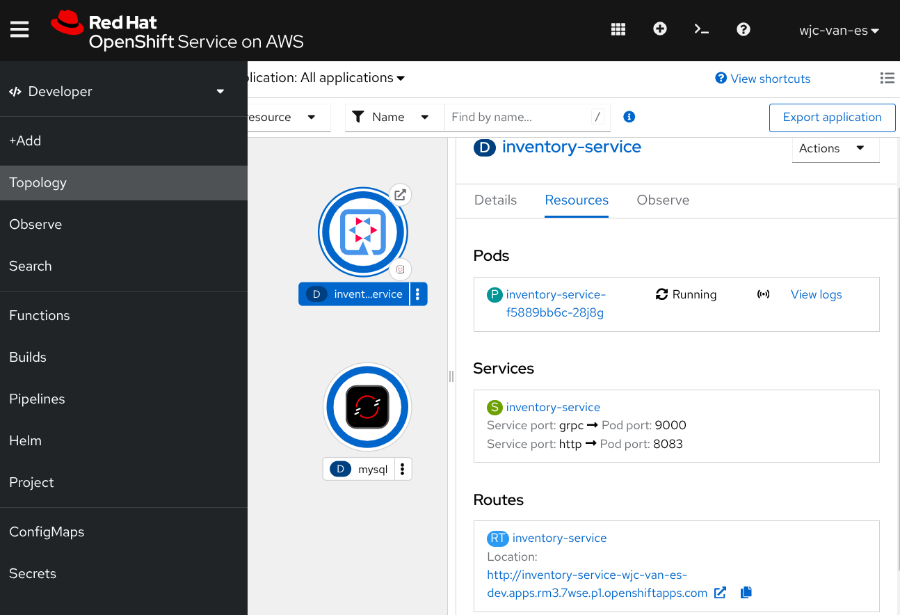

<style>
body {
  font-family: "Gentium Basic", Cardo , "Linux Libertine o", "Palatino Linotype", Cambria, serif;
  font-size: 100% !important;
  padding-right: 12%;
}
code {
  padding: 0.25em;
	
  white-space: pre;
  font-family: "Tlwg mono", Consolas, "Liberation Mono", Menlo, Courier, monospace;
	
  background-color: #ECFFFA;
  //border: 1px solid #ccc;
  //border-radius: 3px;
}

kbd {
  display: inline-block;
  padding: 3px 5px;
  font-family: "Tlwg mono", Consolas, "Liberation Mono", Menlo, Courier, monospace;
  line-height: 10px;
  color: #555;
  vertical-align: middle;
  background-color: #ECFFFA;
  border: solid 1px #ccc;
  border-bottom-color: #bbb;
  border-radius: 3px;
  box-shadow: inset 0 -1px 0 #bbb;
}

h1,h2,h3,h4,h5 {
  color: #269B7D; 
  font-family: "fira sans", "Latin Modern Sans", Calibri, "Trebuchet MS", sans-serif;
}

</style>

# §11.3.4 Deploying Quarkus applications on OpenShift

## OpenShift is a Kubernetes implementation by RedHat
- OpenShift (https://mng.bz/7pVy) is a Red Hat-branded version fork of Kubernetes
- Most features of k8s also apply to OpenShift
- It has additional features
- Free public OpenShift instance called Sandbox that can be used for testing
  - You can either use _Sandbox_ or
  - _OpenShift_ Local [https://developers.redhat.com/products/openshift-local/overview](https://developers.redhat.com/products/openshift-local/overview)
- 

## Remove kubernetes extension from inventory-service and install openshift extension instead
- Remove the kubernetes extension: `~/git/quia/services/inventory-service$ quarkus ext remove quarkus-kubernetes`
- Add the OpenShift extension: `~/git/quia/services/inventory-service$ quarkus ext add quarkus-openshift`
- Add `quarkus.container-image.builder=openshift` to
  [../services/inventory-service/src/main/resources/application.properties](../services/inventory-service/src/main/resources/application.properties)

## exchange kubernetes config for openshift to prepare for deployment on RedHat's Sandbox OpenShift environment
In [application.properties](../services/inventory-service/src/main/resources/application.properties)
substitute
```properties
## openshift
quarkus.openshift.namespace=wjc-van-es-dev
quarkus.openshift.env.vars.quarkus-datasource-jdbc-url=jdbc:mysql://mysql:3306/inventory
quarkus.openshift.prometheus.generate-service-monitor=false
# Expose created service to the world
quarkus.openshift.route.expose=true
```
for
```properties
#quarkus.kubernetes.namespace=default
#quarkus.kubernetes.env.vars.quarkus-datasource-jdbc-url=jdbc:mysql://mysql:3306/inventory
#quarkus.kubernetes.prometheus.generate-service-monitor=false
```
- the value of `quarkus.openshift.namespace` is derived from your RedHat developers account username with the `-dev`
  suffix
- `quarkus.openshift.route.expose=true` will enable the creation of a _Route_ (an OpenShift variance on k8s _Ingress_)
- rename (or copy)
  - [src/main/kubernetes/kubernetes.yml](../services/inventory-service/src/main/kubernetes/kubernetes.yml) to
  - [src/main/kubernetes/openshift.yml](../services/inventory-service/src/main/kubernetes/openshift.yml)
    to add a MySQL DB instance to the deployment
- We need to have _OpenShift Client_ installed see [§11.6.1 Setup](#1161-setup)
- We log in `oc login --token=$MY_TOKEN --server=https://api.rm3.7wse.p1.openshiftapps.com:6443`
  - we can acquire this (with the actual value for `$MY_TOKEN` from the dropdown on your account's username in the
    top-right corner of the 
- Change to the right namespace: `oc project wjc-van-es-dev`
- Check with`oc whoami`
- Build the service: 
  - `~/git/quia/services/inventory-service$ sdk env`
  - `~/git/quia/services/inventory-service$ mvn clean package -e`
- `~/git/quia/services/inventory-service$ oc apply -f target/kubernetes/openshift.yml`

This returns
```bash
service/mysql created
service/inventory-service created
imagestream.image.openshift.io/openjdk-21 created
imagestream.image.openshift.io/inventory-service created
buildconfig.build.openshift.io/inventory-service created
deployment.apps/mysql created
deployment.apps/inventory-service created
route.route.openshift.io/inventory-service created
```
- `oc get pods`
- `oc get routes`
- `oc get all`
- We can obtain the web console URL with `oc whoami --show-console`
- However, in the web console, we can see that it takes some 5 retries of the Inventory service as it has to wait for
  the MySQL DB instance deployment to be ready
- Then we can test with the URL from either
  - `oc get routes`
  - Topologies > click on Deployment _inventory_service_ > Resources > Routes
    
- In case of using the latter, make sure to change the protocol of the URL from `https://` to `http://`
- And give it the suffix:
  - `/q/graphql-ui` for GraphQL queries 
    (see [chapter-04-handling-communications.md](chapter-04-handling-communications.md#452-invoking-graphql-operations-using-the-ui))
- You can also use the suffixes for health probes:
  - `/q/health/live`
  - `/q/health/started`
  - `/q/health/ready`

# §11.4 Different ways to deploy applications
- CLI tools like `kubectl` and `oc` involve manual steps
- quarkus extensions that integrate with _Fabric8_ providing programmatic access to k8s & OpenShift REST API that could
  help writing complete deployment pipelines, processing and monitoring
  - `quarkus-kubernetes-client`
  - `quarkus-openshift-client`
  

# §11.6 Deploying car rental in the cloud

## §11.6.1 Setup
- [https://developers.redhat.com/developer-sandbox](https://developers.redhat.com/developer-sandbox)
- [https://console.redhat.com/openshift/sandbox](https://console.redhat.com/openshift/sandbox)
  -  For local login, we need the oc (OpenShift client) tool, that you can download from the question mark button
  - [https://console-openshift-console.apps.rm3.7wse.p1.openshiftapps.com/command-line-tools](https://console-openshift-console.apps.rm3.7wse.p1.openshiftapps.com/command-line-tools)
  - download the binary (oc.tar)
  - unpack the oc file and move it to your execution path `sudo mv oc /usr/local/bin`
  - `oc version`
  - `oc --help`
  - From this download page we can also click on
    - [Copy login command](https://oauth-openshift.apps.rm3.7wse.p1.openshiftapps.com/oauth/token/request)
    - or acquire this from the dropdown on your account's username in the top-right corner
  - This will open a page with the `oc login` command with `$MY_TOKEN` value fully specified
  - Therefore, login from your laptop terminal:
    `oc login --token=$MY_TOKEN --server=https://api.rm3.7wse.p1.openshiftapps.com:6443`
  - `oc project wjc-van-es-dev`
  - `oc whoami`
- See also 
  [https://docs.openshift.com/container-platform/4.17/cli_reference/openshift_cli/getting-started-cli.html](https://docs.openshift.com/container-platform/4.17/cli_reference/openshift_cli/getting-started-cli.html)