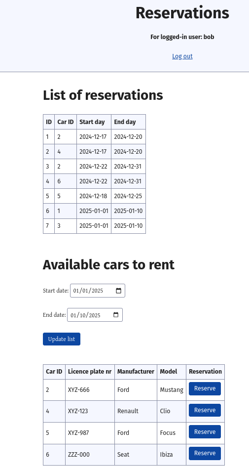

# §6.4.2 production mode test run

## Prerequisites
- The docker compose configuration 
  - explained in [§6.4-modifying-postgres-&-keycloak.md](§6.4-modifying-postgres-&-keycloak.md)
  - test run reported in [§6.4-docker-compose-first-run@willem-latitude-5590.md](§6.4-docker-compose-first-run@willem-latitude-5590.md)
- The `%prod.` prefixed properties added to
  - [../services/reservation-service/src/main/resources/application.properties](../services/reservation-service/src/main/resources/application.properties)
  - [../services/users-service/src/main/resources/application.properties](../services/users-service/src/main/resources/application.properties)

## Starting the run sequence (in 3 separate terminals each in different service root dir)
1. `~/git/quia$ docker compose up -d`, start up containers with keycloak set up
2. `~/git/quia/services/inventory-service$ sdk env`, ensure java 21
3. `~/git/quia/services/inventory-service$ quarkus dev`, may run in dev mode
4. `~/git/quia/services/reservation-service$ sdk env`, ensure java 21
5. `~/git/quia/services/reservation-service$ mvn clean package`, build the reservation-service
6. `~/git/quia/services/users-service$ sdk env`, ensure java 21
7. `~/git/quia/services/users-service$ mvn clean package`, build the users-service
8. `~/git/quia/services/reservation-service$ java -jar target/quarkus-app/quarkus-run.jar`, run reservation-service in 
   prod mode
9. `~/git/quia/services/users-service$ java -jar target/quarkus-app/quarkus-run.jar`, run users-service in prod mode
10. open [`http://localhost:8080/`](http://localhost:8080/) in a browser and log in as bob or alice

### result: everything runs fine

#### screenshot of running users GUI service

